# 編隊について (工事中)  

## 編隊紹介  
編隊紹介の個別ページには、挙動の紹介、向きの見分け方、パーフェクトの取り方を記載している。
編隊番号はゲーム内部で用いられる数値をそのまま使用している。従来慣用的に用いられてきた分類記号も追って追加する予定。  
編隊紹介文を長々と書いたが読む必要はない。編隊は更に小ブロックに細分され、ブロックごとの動きは複数の編隊で使いまわされている、という事実を覚えておけば十分である。  

## 編隊の向き
編隊には左右の向きがあり、ラウンド開始から、左、右、左、右、……と、1編隊ごとに交互に登場する。**ラウンド開始直後の編隊は必ず左向きである。**  
編隊の向きを判別できると、次の編隊の出現位置先読みや、編隊21(いわゆるバックアタック編隊)の衝突予防ができるようになる。  
編隊紹介の個別ページには、左右対称の編隊でない限り、向きの見分け方を載せている。

## パーフェクトの取り方  
**構成する編隊ザコの一部に欠失がある場合を除き、36種類全ての編隊でパーフェクトを取ることができる。**
パーフェクトの取り方は、なるべく標準的なものを記載するようにしている。  
編隊8など一部の編隊で用いられるテクニックとして、起爆後、爆風が発生し周囲を巻き込むよりも前に、他のザコにショットを撃ち込んで耐久力を削るというものがある。

画像をクリックまたはタップすると編隊紹介の個別ページに飛びます

| 0 | 1 | 2 | 3 | 
| ---  |--- | --- | --- |  
| [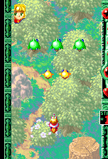](00.md) |  |  | [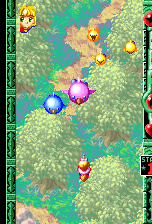](03.md) |

| 4 | 5 | 6 | 7 |  
| ---  |--- | --- | --- | 
|  | [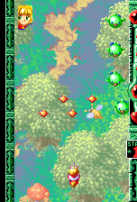](05.md) | [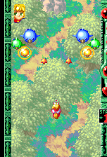](06.md) | [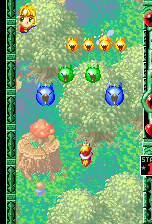](07.md) |

以上8編隊は、ラウンド開始から(泡編隊の挿入を除いて)8編隊目までにのみ登場する。
___

| 8 | 9 | 10 | 11 |  
| ---  |--- | --- | --- | 
| [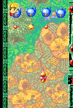](08.md) | [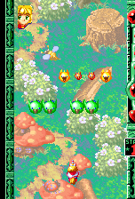](09.md) |  | [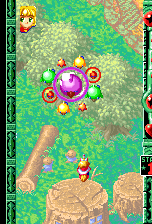](11.md) |

| 12 | 13 | 14 | 15 |  
| ---  |--- | --- | --- | 
| [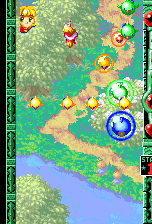](12.md) | [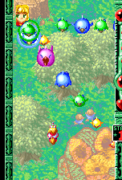](13.md) | [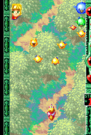](14.md) | [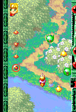](15.md) |

| 16 | 17 | 18 | 19 |  
| ---  |--- | --- | --- | 
| [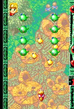](16.md) | [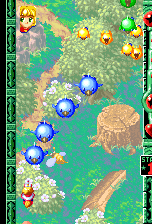](17.md) |  | [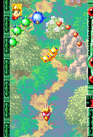](19.md) |

| 20 | 21 | 22 | 23 |  
| ---  |--- | --- | --- | 
| [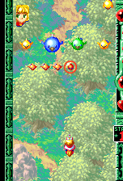](20.md) | [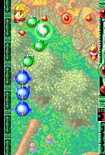](21.md) | [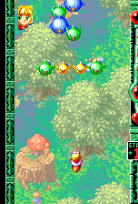](22.md) | [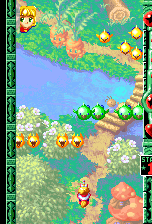](23.md) |

| 24 | 25 | 26 | 27 |  
| ---  |--- | --- | --- | 
| [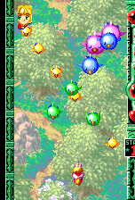](24.md) | [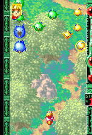](25.md) | [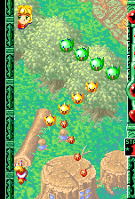](26.md) | [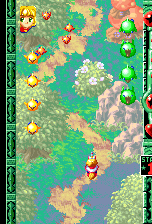](27.md) |

| 28 | 29 | 30 | 31 |  
| ---  |--- | --- | --- | 
| [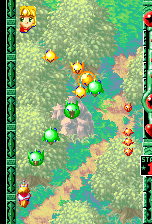](28.md) | [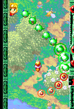](29.md) | [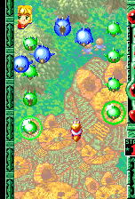](30.md) | [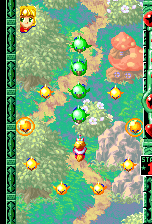](31.md) |

___
以下4編隊は警告直後に挿入された場合のみ登場する。

| 32 | 33 | 34 | 35 |  
| ---  |--- | --- | --- | 
| [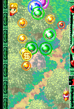](32.md) | [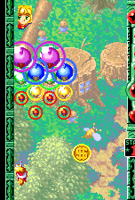](33.md) | [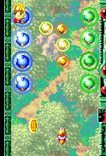](34.md) | [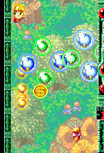](35.md) |
